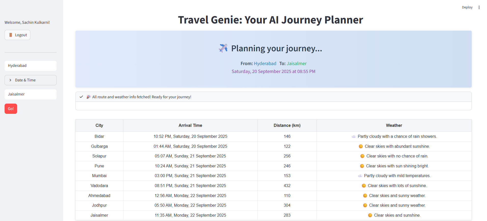

# Travel Genie: Your AI Journey Planner

## 🌟 Overview
Travel Genie is an AI-powered journey planner designed to make your travel experience seamless and enjoyable. Whether you're planning a trip across cities or exploring weather conditions, Travel Genie has got you covered with its intelligent features and user-friendly interface.

---

## 🚀 Features

### 1. **AI-Powered Route Planning**
- Automatically calculates the best routes between cities.
- Provides estimated arrival times and distances.

### 2. **Weather Insights**
- Get real-time weather updates for your destinations.
- Displays weather conditions like clear skies, sunny weather, or cloudy skies.

### 3. **Interactive Sidebar**
- Input your start and end cities.
- Select date and time for your journey.

### 4. **User Authentication**
- Secure login and logout functionality.
- Personalized experience with user-specific data.
### Login Page


---

## 🛠️ Installation

1. Clone the repository:
   ```bash
   git clone https://github.com/sachink108/travel-genie.git
   ```

2. Navigate to the project directory:
   ```bash
   cd travel-genie
   ```

3. Install dependencies using Poetry:
   ```bash
   poetry install
   ```

4. Run the application:
   ```bash
   streamlit run ai_travel/main.py
   ```

---

## 📧 Contact

For any queries or feedback, reach out to:
- **Email**: [sachink108@gmail.com](mailto:sachink108@gmail.com)

---

## 📜 License

This project is licensed under the MIT License. See the [LICENSE](LICENSE) file for details.
